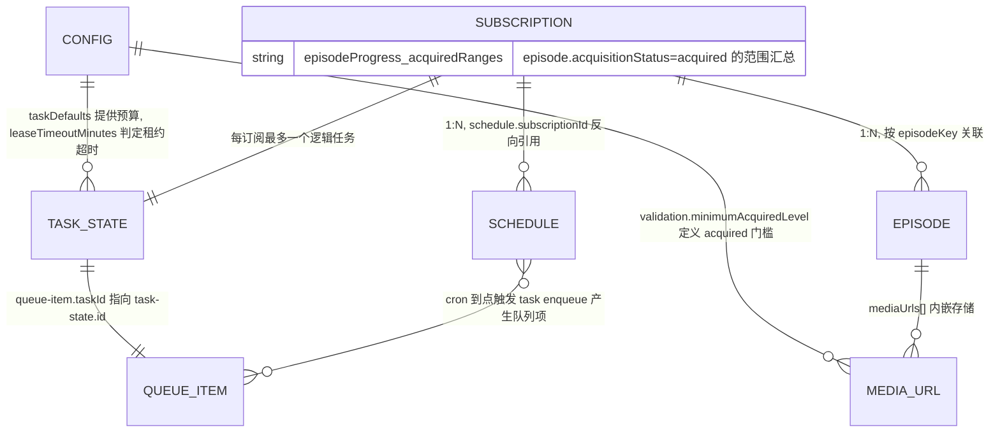

# zhuiju Schema 数据契约参考（中英对照）

本文档描述 `schemas/` 目录下 7 个持久化数据契约的字段、约束，以及它们之间的关系，用于评估整体数据模型设计。

所有 Schema 均为 JSON Schema draft 2020-12，且 `additionalProperties: false`（除声明字段外不允许额外字段），演进通过 `schemaVersion`（当前支持 1、2）管理。

## 1. 总览（Overview）

| Schema 文件 | 中文名 | 作用 | 存储归属 |
| --- | --- | --- | --- |
| `config.schema.json` | 全局配置 (Global Configuration) | 用户级运行策略：并发、预算、验证门槛、保留策略、通知开关 | `~/.zhuiju/config.json`（经 `ZHUIJU_HOME` 可重定向） |
| `subscription.schema.json` | 订阅 (Subscription) | 聚合根：内容元数据、剧集进度汇总、来源/增量策略、例外规则 | 订阅主文件 |
| `episode.schema.json` | 剧集 (Episode) | 单集记录：发布状态、获取状态、内嵌的媒体地址列表 | 订阅内剧集文件 |
| `media-url.schema.json` | 媒体地址 (Media URL) | 单条媒体 URL 的完整生命周期：可用性、验证级别、来源溯源 | 内嵌于 `episode.mediaUrls[]` |
| `queue-item.schema.json` | 队列项 (Queue Item) | 调度入队凭证：把一次触发绑定到一个任务与订阅 | 队列文件 |
| `task-state.schema.json` | 任务状态 (Task State) | 任务运行时可变状态：阶段、心跳、预算、进度、错误 | 任务文件 |
| `schedule.schema.json` | 排期 (Schedule) | 订阅在宿主调度器（cron）上的注册信息：时区、触发时刻、宿主任务 ID | 排期文件 |

## 2. 关系图（Relationship Diagram）

数据流主线：**Schedule（cron 到点）→ `task enqueue` → Queue Item + Task State（创建/合并）→ Agent 提取循环（phase 推进、heartbeat 心跳）→ `media submit` → Media URL 内嵌进 Episode → Episode 的 `acquisitionStatus` 更新 → Subscription 的 `acquiredRanges` 汇总更新 → 通知**。

## 3. 字段明细（Field Reference）

### 3.1 config — 全局配置（Global Configuration）

配置不直接引用任何实体，但通过"预算来源""验证门槛""租约超时"三条线影响 Task State 与 Media URL 的判定。

| 字段 (Field) | 类型 (Type) | 约束 (Constraints) | 备注 (Description) |
| --- | --- | --- | --- |
| `schemaVersion` | integer | enum `[1, 2]` | 配置契约版本 |
| `defaultTimezone` | string | minLength 1 | 默认时区（IANA 名称），用于排期与发布时间换算 |
| `concurrency` | object | 必填 | 并发控制块 |
| `concurrency.maximumActiveSubscriptions` | integer | ≥ 1 | 全局同时运行的订阅任务上限（lease 槽位数） |
| `concurrency.perSubscription` | integer | const `1` | 每订阅并发任务数，当前固定为 1 |
| `concurrency.onSubscriptionOverlap` | string | const `"coalesce"` | 重叠触发策略，当前固定为"合并" |
| `concurrency.leaseTimeoutMinutes` | integer | ≥ 1 | 任务租约超时分钟数，配合 `task-state.heartbeatAt` 判定任务死亡 |
| `taskDefaults` | object | 必填 | 任务预算默认值，填充 `task-state.budget` |
| `taskDefaults.maximumDurationMinutes` | integer | ≥ 1 | 单任务最长运行时长（分钟） |
| `taskDefaults.maximumPages` | integer | ≥ 1 | 页面访问预算 |
| `taskDefaults.maximumBrowserNavigations` | integer | ≥ 0 | 浏览器导航预算，0 表示禁用浏览器 |
| `taskDefaults.maximumCandidateUrls` | integer | ≥ 1 | 每集候选 URL 数量上限 |
| `incremental` | object | 必填 | 增量模式默认策略 |
| `incremental.target` | string | const `"latest-missing"` | 增量目标，当前固定为"最新缺失剧集" |
| `incremental.maximumEpisodesPerRun` | integer | ≥ 1 | 单次运行最多处理剧集数 |
| `incremental.includeHistoricalGaps` | boolean | — | 增量运行是否包含历史缺口 |
| `validation` | object | 必填 | 媒体验证策略 |
| `validation.minimumAcquiredLevel` | string | 6 级枚举（见 3.4） | 判定 Episode "已获取"的最低验证级别，与 `media-url.validationLevel` 共用同一枚举 |
| `validation.checkSegments` | boolean | — | 是否采样媒体分片验证 |
| `validation.segmentSampleCount` | integer | ≥ 0 | 分片采样数量 |
| `validation.useFfprobe` | boolean | — | 是否调用 ffprobe 做深度验证 |
| `validation.revalidateOnUserRead` | boolean | — | 用户查询时是否重新验证已有地址 |
| `storage` | object | 必填 | 数据保留策略 |
| `storage.retainInvalidMediaUrls` | boolean | — | 是否保留失效地址作为历史 |
| `storage.retainExpiredMediaUrls` | boolean | — | 是否保留过期地址 |
| `storage.retainLogsDays` | integer | ≥ 0 | 日志保留天数 |
| `storage.retainTracesDays` | integer | ≥ 0 | Trace 保留天数 |
| `storage.backupCount` | integer | ≥ 0 | 主文件备份数量 |
| `notifications` | object | 必填 | 通知开关组 |
| `notifications.notifyOnNewMedia` | boolean | — | 发现新可用地址时通知 |
| `notifications.notifyOnBootstrapComplete` | boolean | — | 首轮补齐完成时通知 |
| `notifications.notifyOnAllMediaExpired` | boolean | — | 全部地址过期时通知 |
| `notifications.notifyOnTemporaryFailure` | boolean | — | 临时失败时通知 |

### 3.2 subscription — 订阅（Subscription）

聚合根。持有内容元数据与进度汇总，其他实体（episode、schedule、task、queue）都通过 `subscriptionId` 或文件归属挂靠在它之下。

| 字段 (Field) | 类型 (Type) | 约束 (Constraints) | 备注 (Description) |
| --- | --- | --- | --- |
| `schemaVersion` | integer | enum `[1, 2]` | 契约版本 |
| `id` | string | `^sub_[A-Za-z0-9_-]+$` | 订阅唯一 ID，前缀 `sub_` |
| `slug` | string | minLength 1 | URL 友好标识符 |
| `title` | string | minLength 1 | 内容标题 |
| `aliases` | string[] | — | 别名列表，用于搜索匹配 |
| `contentType` | string | minLength 1 | 内容类型（动漫 / 电视剧 / 纪录片 / 综艺等，自由文本） |
| `status` | string | enum `airing / completed / paused / cancelled / unknown` | 内容本身的播出状态 |
| `enabled` | boolean | — | 订阅是否启用（false 时暂停调度） |
| `episodeProgress` | object | 必填 | 剧集进度汇总块 |
| `episodeProgress.totalEpisodes` | integer \| null | ≥ 0 或 null | 总集数，未知为 null |
| `episodeProgress.totalEpisodesState` | string | enum `known / not-announced / ongoing-indefinite / uncertain` | 总集数的可知状态，与 `totalEpisodes` 配合表达"未公布 / 无限期连载 / 不确定" |
| `episodeProgress.releaseCatalog` | object | 必填 | 发布目录：实际观测到的已发布范围 |
| `releaseCatalog.latestKnownEpisodeKey` | string \| null | — | 最新已知剧集键 |
| `releaseCatalog.releasedRanges` | range[] | 见 `$defs.range` | 已发布剧集范围列表 |
| `releaseCatalog.state` | string | enum `confirmed / uncertain / failed / never-checked` | 目录的置信状态 |
| `releaseCatalog.checkedAt` | string \| null | — | 最近一次目录核查时间 |
| `releaseCatalog.evidence` | object[] | — | 目录判定的证据链 |
| `episodeProgress.acquiredRanges` | range[] | 见 `$defs.range` | 已获取范围（episode 的 `acquisitionStatus = acquired` 的汇总，由 CLI 派生维护） |
| `releaseSchedule` | object | 宽松（无内部 Schema） | 发布排期声明（如"每周五 24:00"），是 schedule 实体的种子数据 |
| `sourcePolicy` | object | 宽松 | 来源策略：哪些站点允许 / 优先 |
| `incrementalPolicy` | object | 宽松 | 本订阅的增量策略覆盖 |
| `exceptions` | object[] | 宽松 | 例外规则（如特别篇编号、拆分季） |
| `notes` | string[] | — | 人类备注 |
| `createdAt` / `updatedAt` | string | — | 创建 / 更新时间戳 |

`$defs.range`：`{ from: integer ≥ 1, to: integer ≥ 1 }`，表示闭区间剧集范围。

### 3.3 episode — 剧集（Episode）

| 字段 (Field) | 类型 (Type) | 约束 (Constraints) | 备注 (Description) |
| --- | --- | --- | --- |
| `schemaVersion` | integer | enum `[1, 2]` | 契约版本 |
| `episodeKey` | string | minLength 1 | 剧集唯一键（订阅内唯一） |
| `sequence` | integer \| null | ≥ 1 或 null | 数字话数；特别篇等无话数时为 null |
| `displayNumber` | string | minLength 1 | 展示编号（如"第 12 话"、"SP"），与 `sequence` 解耦 |
| `kind` | string | enum `main / special / ova / other` | 剧集类型 |
| `title` | string | minLength 1 | 剧集标题 |
| `releaseAt` | string \| null | — | 发布时间（预计或实际） |
| `releaseStatus` | string | enum `scheduled / released / delayed / skipped / cancelled / unknown` | 发布方视角的状态 |
| `acquisitionStatus` | string | enum `pending / searching / acquired / partially-acquired / not-found / failed / skipped` | 我方获取视角的状态；`acquired` 定义见 SKILL.md：至少一个达到 `minimumAcquiredLevel` 且当前可用的地址 |
| `mediaUrls` | object[] | 宽松 items | 内嵌的媒体地址列表，元素结构由 `media-url.schema.json` 约束（见 4.3 风险点） |
| `notes` | string[] | — | 备注 |
| `createdAt` / `updatedAt` | string | — | 创建 / 更新时间戳 |

### 3.4 media-url — 媒体地址（Media URL）

内嵌于 `episode.mediaUrls[]`，由 `media-store` 按 `normalizedKey` 去重合并。

验证级别阶梯（低 → 高）：`discovered`（仅观测到）→ `http-valid`（HTTP 可达）→ `manifest-valid`（主清单有效）→ `playlist-valid`（子播放列表有效）→ `segment-valid`（采样分片有效）→ `decodable`（ffprobe 可解码）。高级别隐含低级别。

| 字段 (Field) | 类型 (Type) | 约束 (Constraints) | 备注 (Description) |
| --- | --- | --- | --- |
| `schemaVersion` | integer | enum `[1, 2]` | 契约版本 |
| `id` | string | `^media_[A-Za-z0-9_-]+$` | 媒体地址唯一 ID，前缀 `media_` |
| `url` | string | minLength 1 | 实际观测到的完整 URL（绝不推导或猜测） |
| `normalizedKey` | string | minLength 1 | 规范化键，去重合并的依据 |
| `sameResourceGroup` | string \| null | — | 同资源分组 ID：同一视频的不同清晰度 / CDN 变体归属同组 |
| `mediaType` | string | enum `hls-master / hls-media / dash / mp4 / webm / unknown` | 媒体类型（HLS 主清单 / HLS 子播放列表 / DASH / MP4 / WebM） |
| `availability` | string | enum `discovered / checking / playable / temporarily-unavailable / invalid / unsupported` | 当下可用性：此刻能否播放 |
| `accessRequirement` | string | enum `none / headers / session / unknown` | 访问要求（无需 / 需特定头 / 需会话）。注意：具体请求上下文只存于 `requestContext`，不收集凭据 |
| `lifetimeState` | string | enum `active / possibly-expired / expired / unknown` | 地址寿命状态，与 `availability` 正交：寿命回答"这个地址会不会过期" |
| `validationLevel` | string | 6 级枚举（见上） | 已达到的最高验证级别，与 `config.validation.minimumAcquiredLevel` 共用枚举 |
| `variants` | object[] | 宽松 | 同一资源的变体（多码率 / 多 CDN） |
| `requestContext` | object | 宽松 | 重放该 URL 所需的最小请求上下文（如 Referer） |
| `provenance` | object[] | 宽松 | 来源溯源链：在哪个页面 / 哪次观测中发现 |
| `firstSeenAt` | string | — | 首次观测时间 |
| `lastSeenAt` | string | — | 最近观测时间 |
| `lastValidatedAt` | string \| null | — | 最近验证时间 |
| `estimatedExpiresAt` | string \| null | — | 预估过期时间（签名 URL 常见） |
| `seenCount` | integer | ≥ 1 | 累计观测次数 |
| `note` | string \| null | — | 备注 |

### 3.5 queue-item — 队列项（Queue Item）

| 字段 (Field) | 类型 (Type) | 约束 (Constraints) | 备注 (Description) |
| --- | --- | --- | --- |
| `schemaVersion` | integer | enum `[1, 2]` | 契约版本 |
| `id` | string | `^queue_` 前缀 | 队列项唯一 ID |
| `taskId` | string | `^task_` 前缀 | 指向对应的 task-state，入队时一并创建、1:1 绑定 |
| `subscriptionId` | string | — | 所属订阅 |
| `mode` | string | enum `bootstrap / incremental / repair / manual / validate` | 任务模式，与 task-state 一致 |
| `trigger` | string | enum `manual / cron / rerun / system` | 触发来源 |
| `createdAt` | string | — | 入队时间 |
| `reasons` | string[] | — | 触发原因列表；合并（coalesce）时追加到此处，不新建队列项 |
| `status` | string | enum `pending / running / completed / failed / cancelled` | 队列项状态 |

### 3.6 task-state — 任务状态（Task State）

| 字段 (Field) | 类型 (Type) | 约束 (Constraints) | 备注 (Description) |
| --- | --- | --- | --- |
| `schemaVersion` | integer | enum `[1, 2]` | 契约版本 |
| `id` | string | `^task_` 前缀 | 任务唯一 ID |
| `subscriptionId` | string | — | 所属订阅；一订阅最多一个逻辑任务 |
| `status` | string | enum `idle / queued / running / completed / failed / paused / cancelled` | 任务生命周期状态 |
| `mode` | string | enum 同 queue-item | 任务模式 |
| `trigger` | string | enum 同 queue-item | 触发来源 |
| `reasons` | string[] | — | 触发原因（与 queue-item 同步） |
| `currentEpisodeKey` | string \| null | — | 当前正在处理的剧集 |
| `phase` | string | enum `refreshing-catalog / selecting-target / searching / extracting / validating / persisting / notifying / idle` | 提取循环当前阶段 |
| `startedAt` | string \| null | — | 本次运行开始时间 |
| `heartbeatAt` | string \| null | — | 最近心跳时间；超过 `config.concurrency.leaseTimeoutMinutes` 判定租约丢失 |
| `rerunRequested` | boolean | — | 运行中再次触发时不启动第二个任务，只置此标记 |
| `budget` | object | 宽松 | 预算消耗快照，初值来自 `config.taskDefaults` |
| `progress` | object | 宽松 | 进度计数（已处理剧集等） |
| `lastError` | object \| null | 可选 | 最近一次错误（含 code / message / retryable） |
| `result` | object \| null | 可选 | 任务结果摘要 |

### 3.7 schedule — 排期（Schedule）

唯一存在可选字段的 Schema（`oneTimeTriggers`、`suppressed` 不在 required 中）。

| 字段 (Field) | 类型 (Type) | 约束 (Constraints) | 备注 (Description) |
| --- | --- | --- | --- |
| `schemaVersion` | integer | enum `[1, 2]` | 契约版本 |
| `subscriptionId` | string | — | 所属订阅（反向引用） |
| `timezone` | string | minLength 1 | 本排期使用的时区 |
| `rule` | object | 宽松 | 排期规则（如每周几、隔周），由 `subscription.releaseSchedule` 派生细化 |
| `triggerTimes` | string[] | `^[0-2][0-9]:[0-5][0-9]$` | 每日触发时刻列表（HH:mm） |
| `oneTimeTriggers` | object[] | 可选 | 一次性触发（如补录某个特定时间点） |
| `suppressed` | string[] | 可选 | 被抑制的触发标识（如停播周） |
| `hostJobIds` | string[] | — | 宿主调度器（cron）注册的任务 ID，删除排期的凭证 |
| `updatedAt` | string | — | 最近同步时间 |

## 4. 设计评估（Design Assessment）

### 4.1 设计合理的部分

| # | 设计点 | 评价 |
| --- | --- | --- |
| 1 | 三层职责分离：配置（config）/ 领域数据（subscription、episode、media-url）/ 执行（queue-item、task-state、schedule） | 边界清晰。配置变更不影响领域数据结构，执行状态是易失的、可重建的 |
| 2 | media-url 内嵌于 episode（而非独立集合） | 单用户、本地、单文件原子写的场景下避免跨文件 join 与分布式一致性，是正确的取舍 |
| 3 | queue-item 与 task-state 分离 | 把"排队合并语义"（coalesce、reasons 追加）与"运行可变状态"（phase、heartbeat）解耦；队列展示无需读任务文件 |
| 4 | `validationLevel` 六级阶梯贯穿 config 与 media-url | 一个枚举定义 acquired 门槛，两处共用，语义不会漂移 |
| 5 | `availability` 与 `lifetimeState` 正交 | "现在能不能播"和"这个地址会不会过期"是两个独立维度，分开建模避免状态爆炸 |
| 6 | `acquiredRanges` 汇总冗余 | 由 CLI 从 episode 派生维护而非手写，用可控冗余换 O(1) 的订阅级查询 |
| 7 | 所有 Schema 均 `additionalProperties: false` 且 required 全覆盖 | 默认拒绝未知字段，配合 `schemaVersion` 迁移，演进路径明确 |

### 4.2 需要注意的风险点

| # | 风险点 | 说明与建议 |
| --- | --- | --- |
| 1 | `subscription.releaseSchedule` 与 `schedule.rule` 双源 | 同一排期信息存在于两处（订阅内声明 + 排期实体细化）。目前靠 `schedule sync` 从订阅派生，但 Schema 层未表达该方向。建议在两份 Schema 的描述中显式注明"订阅内为声明源（source of truth），schedule 为派生注册态"，避免后续 Agent 直接改 schedule 造成漂移 |
| 2 | `episode.mediaUrls` 的 items 未 `$ref` media-url Schema | episode.schema.json 中 `mediaUrls` 只约束为 `object[]`，与 media-url.schema.json 的关联仅存在于代码（media-store 校验）。Schema 层面无法静态发现这一嵌套关系。建议 episode.schema 通过 `$ref: media-url.schema.json`（或 `$defs` 内联）显式表达 |
| 3 | 宽松 object 字段较多 | `sourcePolicy`、`incrementalPolicy`、`exceptions`、`budget`、`progress`、`rule`、`result` 等均为无内部约束的 object。这是"渐进式披露 + 文档约束"的选择，但意味着这些字段的错误只能靠运行时代码而非 Schema 校验发现。若这些结构已稳定，可考虑收紧 |
| 4 | queue-item 与 task-state 字段重复（mode / trigger / reasons） | 冗余换取队列独立可读，由 queue-manager 同时机创建，漂移风险可控；但若未来支持改派（reassign），需先明确两处以谁为准 |
| 5 | schedule 是唯一有可选字段的 Schema | `oneTimeTriggers` / `suppressed` 未列入 required，与其他 Schema 的"全必填"风格不一致。若是有意（新字段向后兼容），建议在文档注明；否则补齐 |

### 4.3 与 SKILL.md / references 的对应

| Schema | 行为约定所在参考文档 |
| --- | --- |
| subscription、episode | `references/conversation-protocol.md`（订阅流程、acquired 语义） |
| media-url | `references/media-validation.md`（六级验证阶梯、采样策略）、`references/security.md`（SSRF / 凭据边界） |
| task-state、queue-item | `references/task-lifecycle.md`（模式、合并、心跳、预算） |
| schedule | `references/schedule-timing.md`（时区、触发时刻、宿主 cron） |
| config | `references/runtime-capabilities.md`、`references/openclaw.md`（运行时能力与宿主环境） |

---

生成时间：2026-08-20。基于 `schemas/` 当前版本（schemaVersion 1–2）与 `scripts/stores`、`scripts/tasks/queue-manager.mjs` 的实际实现。
